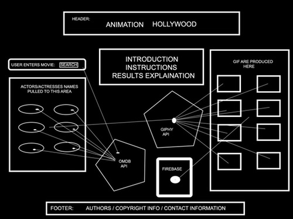

# Project Name
Animating Hollywood

## Team Canary Members:
Chris C., Henry, John and Zhi

## Description:
This app will allow users to enter a movie title into the UI, and it will return a list of the the top 4 actos actors and actresses that appear in that movie as listed in the OMDB API. From there, the user can click on the name of an actor/actress, and a list of GIF’s associated with that actor/actress  in that movie will appear. The app will allow users to save their favorite GIF’s using local storage and to access global favorites liked by all users.

## Wireframes:

How it is Built

Initial Homepage Design

## API's Used:
<ul>
<li><a href="https://www.google.com/url?sa=t&rct=j&q=&esrc=s&source=web&cd=1&cad=rja&uact=8&ved=0ahUKEwiQguLW8-zYAhUPXK0KHVa9D2cQFggpMAA&url=https%3A%2F%2Fwww.omdbapi.com%2F&usg=AOvVaw2cr5g1kM-RWGSITJSZmzwb">
OMDB API - The Open Movie Database</a></li>
<li><a href="https://www.google.com/url?sa=t&rct=j&q=&esrc=s&source=web&cd=1&cad=rja&uact=8&ved=0ahUKEwjlvc_28-zYAhVSeKwKHcn5DQoQFggpMAA&url=https%3A%2F%2Fdevelopers.giphy.com%2F&usg=AOvVaw0d_DDIbrcC6-Ht-lxuj9Sh">Giphy API</a></li>
</ul>

## Live Demo:
<a href="https://henryhankdc.github.io/animating-hollywood/"> Github Pages - Animating Hollywood</a>

